# PatenTrack3 System Architecture

**Stage B — Architecture Design**  
**Version:** 1.0  
**Date:** 2026-02-09  
**Status:** Draft — Sections 1–6

> **⚠️ In Progress** — This document covers Sections 1 through 6. Sections 7–9 (Frontend Architecture, Deployment & Infrastructure, Testing Strategy) will be added in a follow-up session.

---

## Table of Contents

1. [Architecture Overview](#1-architecture-overview)
2. [Data Flow Redesign](#2-data-flow-redesign)
3. [Authentication & Authorization Architecture](#3-authentication--authorization-architecture)
4. [Ingestion Pipeline Architecture](#4-ingestion-pipeline-architecture)
5. [Caching Strategy](#5-caching-strategy)
6. [Real-Time Architecture](#6-real-time-architecture)
7. _(Part B)_ API Design
8. _(Part B)_ Frontend Architecture
9. _(Part B)_ Deployment & Infrastructure
10. _(Part B)_ Testing Strategy

---

## 1. Architecture Overview

### 1.1 High-Level System Diagram

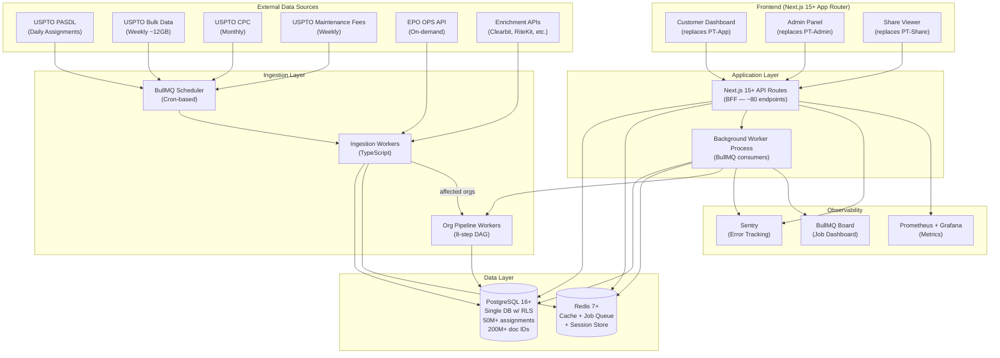

### 1.2 Monorepo Structure

```
patentrack3/
├── apps/
│   ├── web/                          # Next.js 15+ (App Router)
│   │   ├── app/
│   │   │   ├── (auth)/               # Login, register, password reset
│   │   │   ├── (dashboard)/          # Customer dashboard (replaces PT-App)
│   │   │   ├── (admin)/              # Admin panel (replaces PT-Admin)
│   │   │   ├── share/[code]/         # Public share viewer (replaces PT-Share)
│   │   │   └── api/                  # Next.js API routes (~80 endpoints)
│   │   │       ├── auth/             # Auth endpoints
│   │   │       ├── assets/           # Asset CRUD
│   │   │       ├── dashboards/       # Dashboard data
│   │   │       ├── events/           # Event tabs, maintenance fees
│   │   │       ├── families/         # EPO patent families
│   │   │       ├── organizations/    # Org management
│   │   │       ├── admin/            # Admin endpoints
│   │   │       ├── share/            # Share link management
│   │   │       ├── ingestion/        # Ingestion status/triggers (admin)
│   │   │       └── webhooks/         # External webhooks
│   │   ├── middleware.ts             # Auth validation, RLS context
│   │   └── next.config.ts
│   └── worker/                       # Background worker process
│       ├── src/
│       │   ├── consumers/            # BullMQ job consumers
│       │   │   ├── ingest-assignments.ts
│       │   │   ├── ingest-grants.ts
│       │   │   ├── ingest-applications.ts
│       │   │   ├── ingest-cpc.ts
│       │   │   ├── ingest-maintenance-fees.ts
│       │   │   ├── ingest-epo-family.ts
│       │   │   ├── enrich-company.ts
│       │   │   └── pipeline-org.ts   # 8-step DAG orchestrator
│       │   ├── scheduler.ts          # Cron → BullMQ job scheduling
│       │   └── index.ts              # Worker entry point
│       └── package.json
├── packages/
│   ├── db/                           # Database layer
│   │   ├── schema/                   # Drizzle schema definitions
│   │   │   ├── patents.ts
│   │   │   ├── assignments.ts
│   │   │   ├── organizations.ts
│   │   │   ├── users.ts
│   │   │   ├── ingestion.ts
│   │   │   └── index.ts
│   │   ├── migrations/               # Version-controlled migrations
│   │   ├── rls-policies.sql          # Row-Level Security policies
│   │   ├── seed.ts                   # Seed data for development
│   │   └── client.ts                 # Database client with RLS helpers
│   ├── business-rules/               # 65 business rules as tested modules
│   │   ├── classification/           # BR-001 to BR-012
│   │   │   ├── classify-conveyance.ts
│   │   │   ├── priority-resolver.ts
│   │   │   └── __tests__/
│   │   ├── normalization/            # BR-013 to BR-020
│   │   │   ├── normalize-entity-name.ts
│   │   │   ├── levenshtein-grouping.ts
│   │   │   ├── canonical-name-selector.ts
│   │   │   └── __tests__/
│   │   ├── inventor-matching/        # BR-021 to BR-023
│   │   │   ├── name-variations.ts
│   │   │   ├── match-inventor-to-assignor.ts
│   │   │   └── __tests__/
│   │   ├── ownership-tree/           # BR-024 to BR-031
│   │   │   ├── build-tree.ts
│   │   │   ├── tree-type-resolver.ts
│   │   │   ├── color-mapper.ts
│   │   │   └── __tests__/
│   │   ├── broken-title/             # BR-032 to BR-036
│   │   │   ├── detect-broken-chains.ts
│   │   │   ├── chain-validator.ts
│   │   │   └── __tests__/
│   │   ├── dashboard/                # BR-037 to BR-043
│   │   │   ├── dashboard-aggregator.ts
│   │   │   ├── summary-calculator.ts
│   │   │   └── __tests__/
│   │   └── index.ts
│   ├── ingestion/                    # Data ingestion pipeline
│   │   ├── downloaders/              # Source-specific downloaders
│   │   │   ├── uspto-pasdl.ts
│   │   │   ├── uspto-bulk.ts
│   │   │   ├── epo-ops.ts
│   │   │   └── enrichment.ts
│   │   ├── parsers/                  # Format-specific parsers
│   │   │   ├── xml-streaming.ts      # SAX-based for 12GB files
│   │   │   ├── tab-delimited.ts
│   │   │   └── json.ts
│   │   ├── transformers/             # Data transformation
│   │   │   ├── assignment-transformer.ts
│   │   │   ├── bibliographic-transformer.ts
│   │   │   └── cpc-transformer.ts
│   │   ├── loaders/                  # Database loaders (upsert logic)
│   │   │   ├── batch-upsert.ts       # Generic ON CONFLICT DO UPDATE
│   │   │   └── bulk-loader.ts        # COPY-based bulk loading
│   │   └── index.ts
│   ├── shared/                       # Shared types, utils, constants
│   │   ├── types/
│   │   │   ├── patent.ts
│   │   │   ├── assignment.ts
│   │   │   ├── organization.ts
│   │   │   ├── user.ts
│   │   │   ├── ingestion.ts
│   │   │   └── api.ts
│   │   ├── constants/
│   │   │   ├── conveyance-types.ts   # BR-001 to BR-012 enums
│   │   │   ├── tree-types.ts         # BR-024 to BR-031 enums
│   │   │   ├── dashboard-types.ts    # BR-037 enums
│   │   │   └── roles.ts             # BR-048, BR-049
│   │   ├── utils/
│   │   │   ├── levenshtein.ts
│   │   │   ├── name-utils.ts
│   │   │   └── date-utils.ts
│   │   └── index.ts
│   └── ui/                           # Shared React components
│       ├── components/
│       │   ├── ownership-diagram/    # D3 SVG ownership visualization
│       │   ├── timeline/             # Transaction timeline
│       │   ├── data-table/           # Virtualized data table
│       │   ├── cpc-word-cloud/       # CPC classification word cloud
│       │   └── pdf-viewer/           # Patent PDF viewer
│       └── index.ts
├── tools/
│   └── scripts/
│       ├── migrate-legacy/           # Legacy data migration scripts
│       │   ├── phase1-core-patent.ts
│       │   ├── phase2-bibliographic.ts
│       │   ├── phase3-organizations.ts
│       │   ├── phase4-computed.ts
│       │   └── phase5-ingestion-meta.ts
│       ├── seed-dev-data.ts
│       └── validate-migration.ts
├── turbo.json
├── package.json
├── tsconfig.json                     # Base TypeScript config
└── .env.example
```

### 1.3 API Server Decision: Hybrid (Option C)

**Decision:** Next.js API routes as BFF + separate worker process for background jobs.

**Rationale:**

| Concern | Next.js API Routes | Separate Worker Process |
|---------|-------------------|------------------------|
| Request-response API (~80 endpoints) | ✅ Handled by Next.js | — |
| SSR/RSC data loading | ✅ Direct DB access in Server Components | — |
| Auth middleware | ✅ Next.js middleware | — |
| Heavy background processing (12GB ingestion) | ❌ Would block/timeout | ✅ Long-running BullMQ consumers |
| 8-step org pipeline (minutes per org) | ❌ Request timeout | ✅ DAG execution w/ retries |
| Cron scheduling | ❌ Not native | ✅ BullMQ repeatable jobs |
| WebSocket/SSE for real-time updates | ✅ Next.js SSE via route handlers | ✅ Can push job status events |
| Scale independently | — | ✅ Scale workers by queue depth |

**Why not a full separate Fastify server?**
- At <100 tenants and ~80 endpoints, a separate API server adds deployment complexity without sufficient benefit.
- Next.js API routes handle request-response efficiently and share the deployment with the frontend.
- Server Components can query the database directly, eliminating round-trips for server-rendered pages.
- The worker process is the only component that needs to run independently (for long-running ingestion jobs and pipeline processing).

**Why not Next.js only?**
- 12GB file ingestion would exceed serverless/edge function timeouts.
- The 8-step org pipeline runs for minutes per organization and should not compete with HTTP request resources.
- BullMQ requires a persistent Node.js process to consume jobs.

### 1.4 Key Technology Decisions

| Component | Technology | Justification |
|-----------|-----------|---------------|
| **Framework** | Next.js 15+ (App Router) | Server Components, API routes, SSR/SSG, middleware |
| **Language** | TypeScript (strict mode) | Type safety, shared types across all packages |
| **Database** | PostgreSQL 16+ | RLS, JSONB, partitioning, full-text search, 50M+ scale |
| **ORM** | Drizzle ORM | TypeScript-native, SQL-first, RLS-compatible, lighter than Prisma for heavy queries |
| **Cache/Queue** | Redis 7+ (via ioredis) | BullMQ job queues, session store, query cache |
| **Job Queue** | BullMQ | Reliable, Redis-backed, DAG support, repeatable jobs, dashboard |
| **Monorepo** | Turborepo | Fast incremental builds, task caching, simple config |
| **Auth** | Custom JWT + httpOnly cookies | Replacing 3 auth implementations; no external dependency needed at <1000 users |
| **XML Parser** | sax-js (streaming) | Memory-efficient for 12GB XML files |
| **Visualization** | D3.js v7 | Preserving existing ownership diagram fidelity |
| **Testing** | Vitest + Playwright | Fast unit tests (Vitest), E2E tests (Playwright) |

### 1.5 Communication Patterns

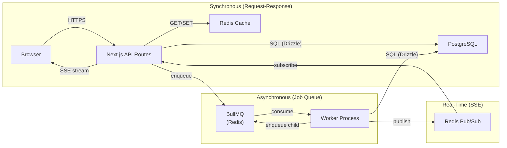

- **Synchronous:** Browser → Next.js API routes → PostgreSQL/Redis. Used for all CRUD operations, dashboard loads, search.
- **Asynchronous:** API enqueues jobs → BullMQ (Redis) → Worker consumes → writes to PostgreSQL. Used for ingestion, pipeline processing, enrichment.
- **Real-Time:** Worker publishes job status to Redis Pub/Sub → Next.js SSE route streams to browser. Used for pipeline progress, ingestion status.

---

## 2. Data Flow Redesign

### 2.1 Flow 1: Assignment/Transaction Data (Daily)

**Schedule:** Daily at 02:00 UTC  
**Source:** USPTO PASDL (ZIP → XML)  
**Business Rules:** BR-054 (API key auth), BR-058 (retry logic), BR-059 (idempotent upserts), BR-060 (8-step pipeline)

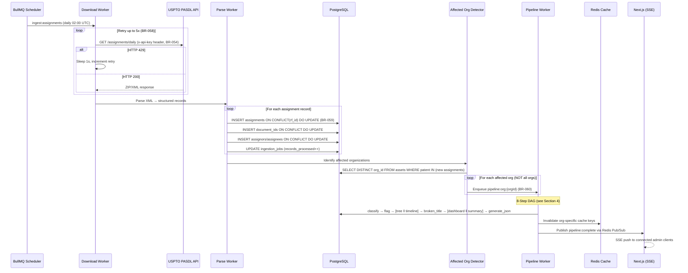

**Key improvements over legacy:**
1. **Selective recomputation** — Only affected orgs are reprocessed (legacy ran all orgs every time)
2. **Idempotent upserts** — `ON CONFLICT ... DO UPDATE` instead of `INSERT IGNORE` (BR-059 upgrade)
3. **DAG parallelism** — Tree and timeline run in parallel; dashboard and summary run in parallel
4. **Cache invalidation** — Targeted invalidation per org instead of no caching at all
5. **Observability** — Every step tracked in `processing_steps` table with metrics

### 2.2 Flow 2: Bibliographic Data (Weekly, ~12GB/week)

**Schedule:** Tuesday 00:00 UTC (grants), Thursday 00:00 UTC (applications) — per BR-055  
**Source:** USPTO Bulk Red Book (TAR → ZIP → XML)  
**Business Rules:** BR-013–BR-020 (name normalization), BR-055 (schedule)

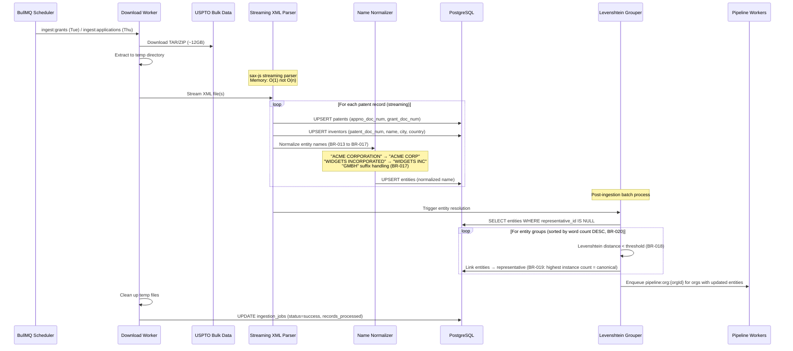

**Key improvements over legacy:**
1. **Single pipeline** — Eliminates PHP/Node duplication (legacy had both `patent_weekly_download.php` and `download_files.js`)
2. **Streaming XML parser** — sax-js processes 12GB files with constant memory (legacy loaded entire XML into memory)
3. **Batch entity resolution** — Levenshtein grouping runs once after all records are loaded, not per-record
4. **Transactional consistency** — Each patent record upserted in a transaction; entity resolution is a separate batch job

### 2.3 Flow 3: Patent Family Data (EPO)

**Schedule:** On-demand (triggered when user views patent family, or after new assignments)  
**Source:** EPO OPS REST API (OAuth2, per-patent queries)  
**Business Rules:** BR-057 (EPO OAuth2), BR-058 (retry logic)

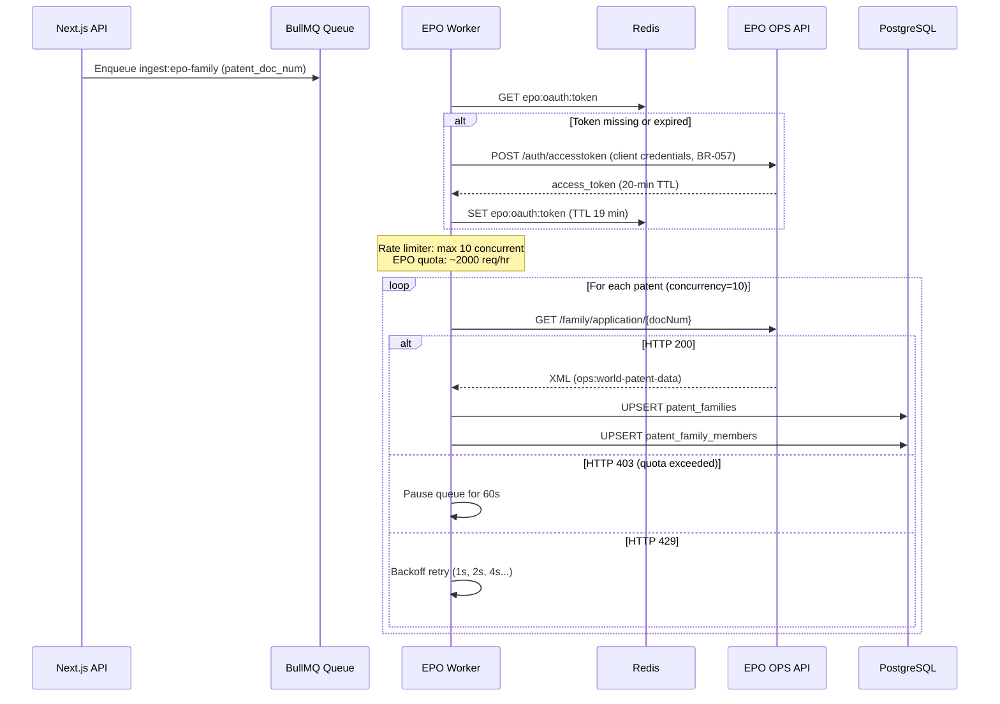

**Key improvements over legacy:**
1. **Redis-based token management** — OAuth2 tokens cached in Redis with proper TTL (legacy cached to filesystem, BR-057)
2. **Concurrency-limited queue** — BullMQ concurrency=10 respects EPO rate limits (legacy had no rate limiting)
3. **Batch strategy** — Can batch-enqueue multiple patents when new assignments arrive

### 2.4 Flow 4: CPC Classification Data (Monthly)

**Schedule:** 1st of each month at 04:00 UTC  
**Source:** USPTO API (ZIP → XML, full dataset) + EPO Linked Data (SPARQL)  
**Business Rules:** BR-056 (full replacement)

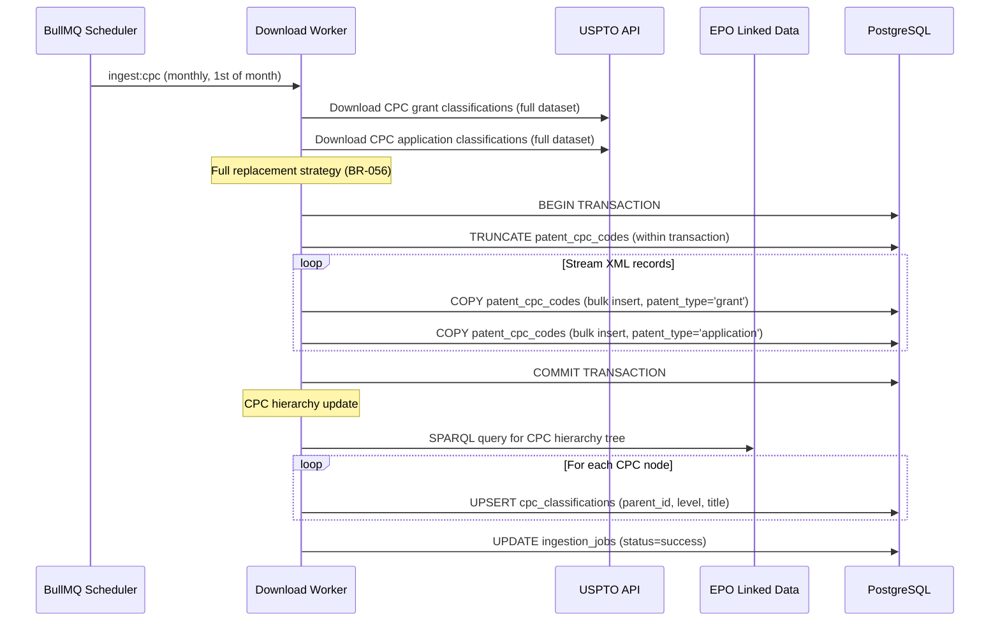

**Key improvements over legacy:**
1. **Atomic replacement** — `TRUNCATE` + `COPY` in a single transaction ensures no partial state
2. **`COPY` for bulk loading** — PostgreSQL `COPY` is 10-100x faster than individual `INSERT` statements
3. **Single pipeline** — Eliminates duplicate `monthly_download_patent_cpc.php` and `monthly_download_applications_cpc.php`

### 2.5 Flow 5: Maintenance Fee Events (Weekly)

**Schedule:** Every Monday at 03:00 UTC  
**Source:** USPTO API (ZIP → tab-delimited text)

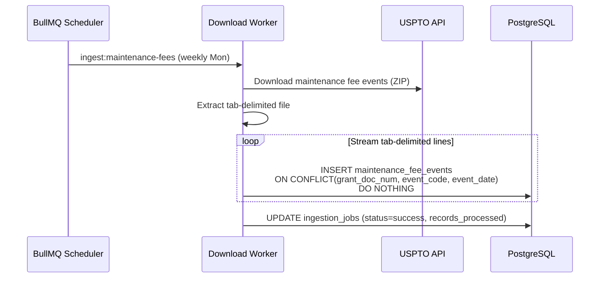

**Key improvements over legacy:**
1. **Streaming line reader** — Processes file line-by-line without loading into memory
2. **Composite unique constraint** — Prevents duplicates at database level
3. **Scheduled** — Automated via BullMQ repeatable jobs (legacy required manual intervention)

### 2.6 Flow 6: Enrichment Data (On-Demand)

**Schedule:** On-demand (triggered when org is created or entity is first viewed)  
**Sources:** Clearbit, RiteKit, PatentsView, etc.  
**Security:** All API keys in secrets manager (fixing S-05, S-06)

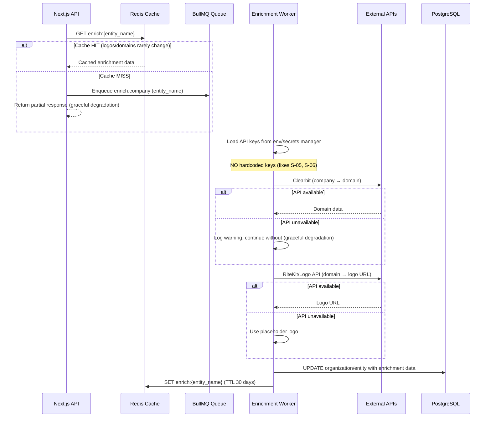

**Key improvements over legacy:**
1. **Secrets manager** — All API keys loaded from environment variables, not hardcoded (fixes S-05, S-06)
2. **Aggressive caching** — Company logos and domains cached for 30 days (legacy had zero caching)
3. **Graceful degradation** — If Clearbit/RiteKit is unavailable, return partial data with placeholder (legacy would fail silently or error)
4. **Async enrichment** — User gets immediate response; enrichment runs in background

---

## 3. Authentication & Authorization Architecture

### 3.1 Auth Architecture Overview

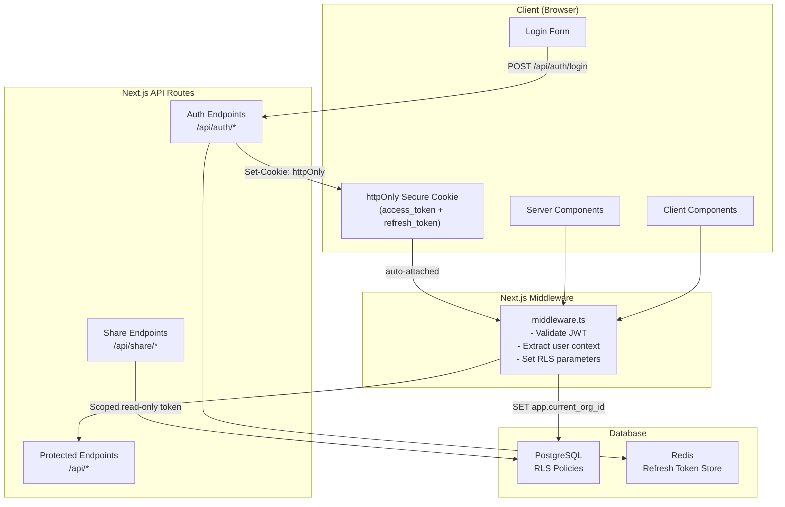

### 3.2 Security Vulnerability Fixes

| Vulnerability | Fix | Implementation |
|--------------|-----|----------------|
| **S-01: Command injection** | Eliminate PHP bridge entirely | No `exec()` calls. All business logic in TypeScript. Zero PHP in new system. |
| **S-02: Token refresh bypass** | Full signature verification on refresh | Refresh tokens are opaque (stored server-side in Redis), not self-contained JWTs. Server validates against stored token. |
| **S-03: Share links grant admin access** | Scoped read-only tokens | Share tokens contain `scope: 'share:read'`, `resource_type`, and `resource_id`. Cannot perform write operations. |
| **S-11: Missing resource authorization** | RLS + middleware | Every request sets `app.current_org_id` via RLS. Middleware extracts org from JWT and sets PostgreSQL session variable. |
| **S-12: Hardcoded JWT secret** | Environment variable (required) | Application fails to start if `JWT_SECRET` env var is not set. No fallback values. KMS preferred for production. |
| **S-13: No rate limiting** | Per-tenant, per-user rate limits | Redis-backed sliding window rate limiter on auth endpoints (10 attempts/min) and API endpoints (1000 req/min per tenant). |
| **S-14: No password complexity** | Enforce minimum requirements | Minimum 12 characters, 1 uppercase, 1 lowercase, 1 digit. Checked at API level + client-side validation. |
| **S-15: No account lockout** | Progressive delays | After 5 failed attempts: 1-min lockout. After 10: 15-min lockout. After 20: account locked (admin unlock required). Tracked in Redis. |
| **S-16: Unauthenticated WebSocket** | All connections require valid token | SSE (replacing WebSocket) routes go through Next.js middleware → JWT validation required. No anonymous real-time connections. |
| **S-19: Dual token storage** | httpOnly cookies only | No `localStorage` for tokens. Access token in httpOnly, Secure, SameSite=Strict cookie. CSRF protection via double-submit pattern. |

### 3.3 RBAC Model

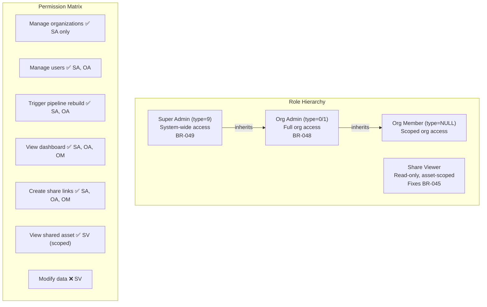

**Role resolution at database level:**

```sql
-- RLS policy for standard org isolation
CREATE POLICY org_isolation ON assets
    USING (organization_id = current_setting('app.current_org_id', true)::uuid);

-- RLS bypass for super admin
CREATE POLICY super_admin_bypass ON assets
    USING (current_setting('app.user_role', true) = '9');

-- Share viewer: scoped to specific resource
CREATE POLICY share_access ON assets
    USING (
        current_setting('app.access_scope', true) = 'share:read'
        AND (
            grant_doc_num = current_setting('app.share_resource_id', true)
            OR appno_doc_num = current_setting('app.share_resource_id', true)
        )
    );
```

### 3.4 Token Lifecycle

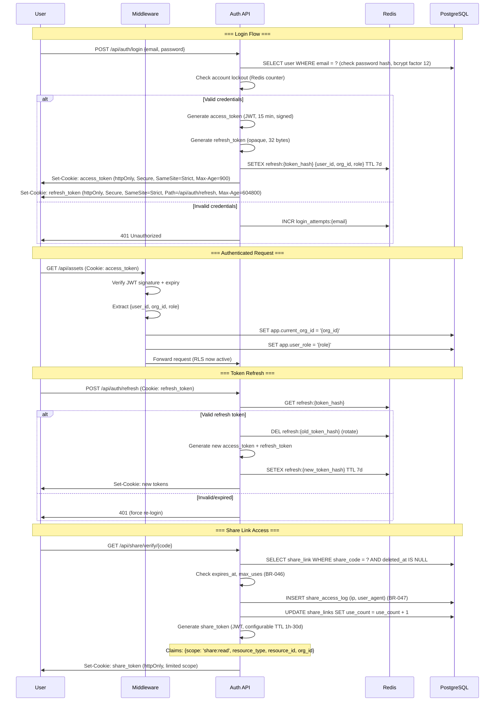

**Token specifications:**

| Token | Type | Lifetime | Storage | Contents |
|-------|------|----------|---------|----------|
| Access Token | Signed JWT (HS256 or RS256) | 15 minutes | httpOnly cookie | `{sub, org_id, role, iat, exp}` |
| Refresh Token | Opaque (crypto.randomBytes(32)) | 7 days, rotated on use | httpOnly cookie (Path=/api/auth/refresh) + Redis server-side | Server-side: `{user_id, org_id, role, created_at}` |
| Share Token | Signed JWT | Configurable (1h–30d) | httpOnly cookie | `{scope: 'share:read', resource_type, resource_id, org_id, exp}` |

### 3.5 Session Management with Next.js

```mermaid
graph LR
    subgraph "Server Components"
        RSC["React Server Component"]
        RSC -->|"1. Read cookie"| MW["middleware.ts"]
        MW -->|"2. Validate JWT"| MW
        MW -->|"3. SET app.current_org_id"| DB["PostgreSQL (RLS active)"]
        DB -->|"4. Filtered data"| RSC
    end

    subgraph "API Routes"
        ROUTE["API Route Handler"]
        ROUTE -->|"Cookie auto-attached"| MW2["middleware.ts"]
        MW2 -->|"SET RLS context"| DB
    end

    subgraph "Client Components"
        CC["Client Component"]
        CC -->|"fetch('/api/...')"| ROUTE
        CC -->|"Cookie auto-attached<br/>by browser"| CC
        Note over CC: No manual token<br/>management needed
    end
```

**Middleware implementation pattern:**

```typescript
// middleware.ts (simplified)
import { NextRequest, NextResponse } from 'next/server';
import { verifyJWT } from '@patentrack/shared/auth';

export async function middleware(request: NextRequest) {
  // Share routes: verify share token
  if (request.nextUrl.pathname.startsWith('/share/')) {
    const shareToken = request.cookies.get('share_token')?.value;
    if (!shareToken) return NextResponse.redirect('/share/expired');
    // Verify + set limited RLS context
  }

  // Auth routes: skip middleware
  if (request.nextUrl.pathname.startsWith('/api/auth/')) {
    return NextResponse.next();
  }

  // All other routes: verify access token
  const accessToken = request.cookies.get('access_token')?.value;
  if (!accessToken) return NextResponse.json({ error: 'Unauthorized' }, { status: 401 });

  const payload = await verifyJWT(accessToken);
  if (!payload) return NextResponse.json({ error: 'Invalid token' }, { status: 401 });

  // Pass user context to API routes via headers (internal only)
  const headers = new Headers(request.headers);
  headers.set('x-user-id', payload.sub);
  headers.set('x-org-id', payload.org_id);
  headers.set('x-user-role', String(payload.role ?? ''));

  return NextResponse.next({ request: { headers } });
}
```

---

## 4. Ingestion Pipeline Architecture

### 4.1 Technology Stack

| Component | Technology | Justification |
|-----------|-----------|---------------|
| **Job Queue** | BullMQ 5.x on Redis | Reliable, Redis-backed, supports DAGs, repeatable jobs, prioritization, rate limiting |
| **Workers** | TypeScript (Node.js 20+) | Shared types with API, access to `packages/business-rules` |
| **XML Parser** | sax-js (streaming SAX) | O(1) memory for 12GB files; event-based parsing |
| **Tab Parser** | Node.js `readline` + custom split | Streaming line-by-line processing |
| **Bulk Loader** | PostgreSQL `COPY` via `pg-copy-streams` | 10-100x faster than individual INSERTs for bulk data |
| **Scheduler** | BullMQ repeatable jobs | Cron-compatible, persistent across restarts, dashboard visibility |
| **Monitoring** | BullMQ Board (bull-board) | Web UI for queue inspection, job retries, metrics |

### 4.2 Job Scheduling

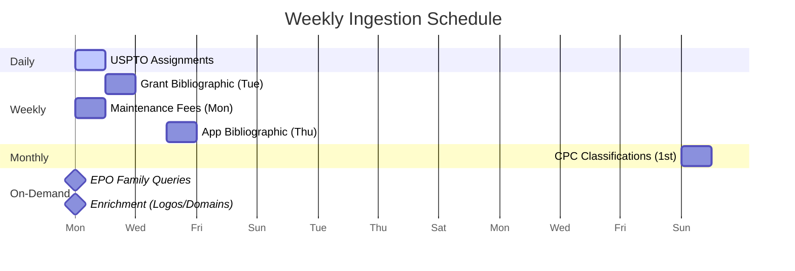

| Schedule | Data Source | Job Name | Queue | Concurrency | BR |
|----------|-----------|----------|-------|-------------|-----|
| `0 2 * * *` (daily 02:00) | USPTO PASDL (assignments) | `ingest:assignments` | `ingestion` | 1 | BR-054 |
| `0 0 * * 2` (Tue 00:00) | USPTO bulk grants (~12GB) | `ingest:grants` | `ingestion` | 1 | BR-055 |
| `0 0 * * 4` (Thu 00:00) | USPTO bulk applications (~12GB) | `ingest:applications` | `ingestion` | 1 | BR-055 |
| `0 3 * * 1` (Mon 03:00) | USPTO maintenance fees | `ingest:maintenance-fees` | `ingestion` | 1 | — |
| `0 4 1 * *` (1st of month) | USPTO CPC classifications | `ingest:cpc` | `ingestion` | 1 | BR-056 |
| On-demand | EPO family data | `ingest:epo-family` | `epo` | 10 | BR-057 |
| On-demand | Enrichment (logos, domains) | `enrich:company` | `enrichment` | 5 | — |
| On new assignments | Per-org pipeline (8 steps) | `pipeline:org:{orgId}` | `pipeline` | 3 | BR-060 |

### 4.3 Pipeline DAG for Per-Org Recomputation (BR-060)

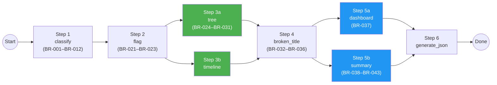

**Parallelism gains:**
- **Sequential (legacy):** Steps 1→2→3→4→5→6→7→8 (all serial)
- **DAG (new):** Steps 1→2→[3a‖3b]→4→[5a‖5b]→6 (8 steps → 6 serial stages, 2 parallel pairs)
- **Estimated speedup:** ~25-30% reduction in pipeline time per org

**Implementation using BullMQ Flow (parent-child jobs):**

```typescript
// pipeline-org.ts (simplified)
import { FlowProducer } from 'bullmq';

const flowProducer = new FlowProducer({ connection: redis });

async function runOrgPipeline(orgId: string, jobType: 'full_rebuild' | 'incremental') {
  await flowProducer.add({
    name: 'generate_json',
    queueName: 'pipeline',
    data: { orgId, step: 6 },
    children: [
      {
        name: 'dashboard',
        queueName: 'pipeline',
        data: { orgId, step: '5a' },
        children: [{
          name: 'broken_title',
          queueName: 'pipeline',
          data: { orgId, step: 4 },
          children: [
            {
              name: 'tree',
              queueName: 'pipeline',
              data: { orgId, step: '3a' },
              children: [{
                name: 'flag',
                queueName: 'pipeline',
                data: { orgId, step: 2 },
                children: [{
                  name: 'classify',
                  queueName: 'pipeline',
                  data: { orgId, step: 1 },
                }],
              }],
            },
            {
              name: 'timeline',
              queueName: 'pipeline',
              data: { orgId, step: '3b' },
              // Also depends on flag (step 2) — BullMQ handles via parent
            },
          ],
        }],
      },
      {
        name: 'summary',
        queueName: 'pipeline',
        data: { orgId, step: '5b' },
        // Also depends on broken_title (step 4) — shares parent
      },
    ],
  });
}
```

### 4.4 Idempotency Strategy

All ingestion jobs are designed to be safely re-runnable (BR-059 upgrade from `INSERT IGNORE` to proper upserts):

| Data Type | Unique Key | Upsert Strategy |
|-----------|-----------|-----------------|
| Assignments | `rf_id` | `ON CONFLICT(rf_id) DO UPDATE SET convey_text=EXCLUDED.convey_text, record_dt=EXCLUDED.record_dt, updated_at=NOW()` |
| Document IDs | `(assignment_id, appno_doc_num, grant_doc_num)` | `ON CONFLICT DO UPDATE SET title=EXCLUDED.title, updated_at=NOW()` |
| Entities | `LOWER(name)` | `ON CONFLICT(LOWER(name)) DO UPDATE SET instances=entities.instances+1` |
| Patents | `appno_doc_num` / `grant_doc_num` | `ON CONFLICT DO UPDATE SET title=EXCLUDED.title, grant_date=EXCLUDED.grant_date` |
| CPC Classifications | `cpc_code` | Full replacement (TRUNCATE + COPY in transaction, BR-056) |
| Maintenance Fees | `(grant_doc_num, event_code, event_date)` | `ON CONFLICT DO NOTHING` (immutable events) |
| Patent Families | `family_id` | `ON CONFLICT(family_id) DO UPDATE SET family_type=EXCLUDED.family_type` |

**Job-level idempotency:**
- Each `ingestion_job` record tracks `records_processed`, `records_inserted`, `records_updated`, `records_failed`
- If a job fails mid-way, re-running it will skip already-inserted records via upserts
- Job records are immutable once `status='success'` — never deleted (temporal audit trail)

### 4.5 Retry Strategy

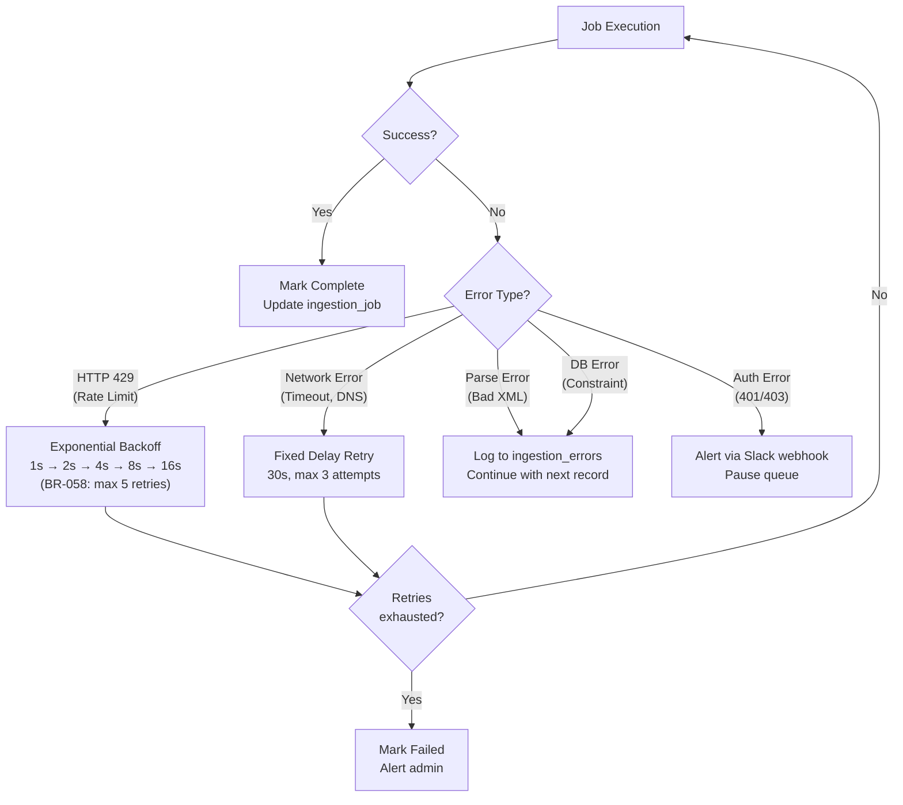

**BullMQ retry configuration:**

```typescript
// Queue configuration for ingestion jobs
const ingestionQueue = new Queue('ingestion', {
  connection: redis,
  defaultJobOptions: {
    attempts: 5,
    backoff: {
      type: 'exponential',
      delay: 1000, // 1s base (BR-058)
    },
    removeOnComplete: { age: 604800 }, // Keep 7 days
    removeOnFail: { age: 2592000 },    // Keep 30 days
  },
});

// EPO queue with rate limiting
const epoQueue = new Queue('epo', {
  connection: redis,
  defaultJobOptions: {
    attempts: 3,
    backoff: { type: 'exponential', delay: 5000 },
  },
  limiter: {
    max: 10,         // Max 10 jobs
    duration: 1000,  // Per second
  },
});
```

### 4.6 Monitoring & Observability

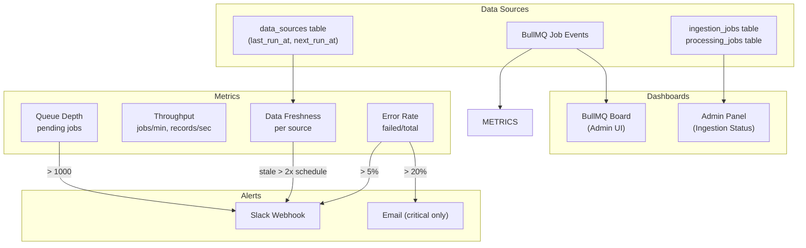

**Data freshness tracking:**

| Source | Expected Freshness | Alert Threshold |
|--------|-------------------|-----------------|
| USPTO Assignments | Updated daily | Stale if > 48 hours |
| Grant Bibliographic | Updated weekly (Tue) | Stale if > 9 days |
| App Bibliographic | Updated weekly (Thu) | Stale if > 9 days |
| Maintenance Fees | Updated weekly (Mon) | Stale if > 9 days |
| CPC Classifications | Updated monthly (1st) | Stale if > 35 days |
| EPO Family Data | On-demand | N/A (cached per-patent) |
| Enrichment Data | On-demand | N/A (cached 30 days) |

**Admin dashboard metrics:**

```typescript
// Exposed via GET /api/admin/ingestion/status
interface IngestionStatus {
  sources: Array<{
    name: string;
    lastRunAt: Date | null;
    nextRunAt: Date | null;
    lastStatus: 'success' | 'failed' | 'partial';
    recordsProcessed: number;
    staleness: 'fresh' | 'warning' | 'stale';
  }>
  queues: Array<{
    name: string;
    waiting: number;
    active: number;
    completed: number;
    failed: number;
    avgDuration: number; // ms
  }>
  pipelines: Array<{
    orgId: string;
    orgName: string;
    status: string;
    currentStep: string;
    startedAt: Date;
    duration: number; // ms
  }>
}
```

### 4.7 Worker Process Architecture

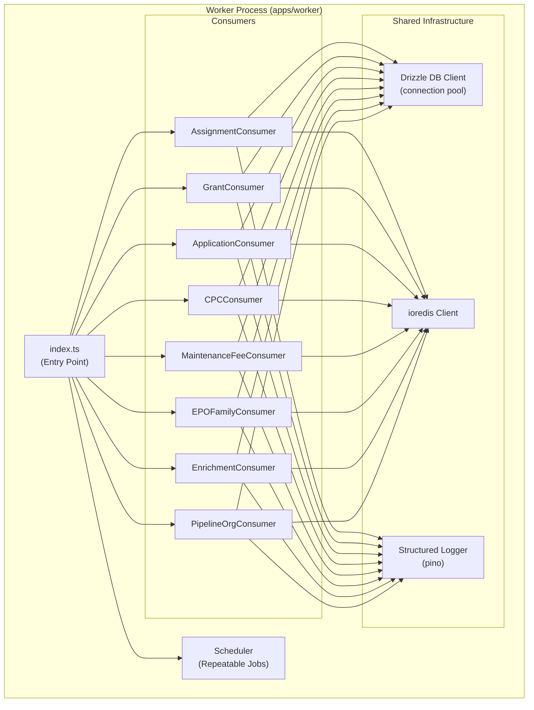

**Graceful shutdown:**

```typescript
// Worker graceful shutdown
process.on('SIGTERM', async () => {
  logger.info('SIGTERM received, shutting down gracefully...');
  
  // Stop accepting new jobs
  await Promise.all(consumers.map(c => c.close()));
  
  // Wait for active jobs to complete (30s timeout)
  await Promise.race([
    Promise.all(consumers.map(c => c.waitUntilReady())),
    new Promise(resolve => setTimeout(resolve, 30000)),
  ]);
  
  // Close connections
  await db.end();
  await redis.quit();
  
  logger.info('Worker shut down cleanly');
  process.exit(0);
});
```

---

## 5. Caching Strategy

### 5.1 Problem Statement

The legacy PatenTrack system has **zero caching** — every request hits the database directly. A single dashboard load triggers **10–30 SQL queries** against PostgreSQL, resulting in high latency (p95 > 2s) and unnecessary database load. The rebuilt system introduces a Redis-based caching layer to reduce query volume, improve response times, and provide a foundation for real-time cache invalidation.

### 5.2 Caching Targets

The following data categories are cacheable, each with a specific key pattern, TTL, and invalidation strategy:

| Data | Cache Key Pattern | TTL | Invalidation Trigger |
|------|-------------------|-----|----------------------|
| Dashboard summary | `org:{id}:dashboard` | Until invalidated | New assignment ingestion for this org |
| Ownership tree JSON | `org:{id}:tree:{assetId}` | Until invalidated | New assignment for this org |
| Patent bibliographic | `patent:{grantNum}:biblio` | 24 hours | Immutable after ingestion |
| CPC hierarchy | `cpc:{code}:tree` | 30 days | Monthly CPC refresh |
| Company logo/domain | `company:{name}:logo` | 7 days | Manual refresh |
| User session | `session:{userId}` | 15 minutes | Logout/revocation |
| API response | `api:{hash}` | Varies | Varies |

**Key design decisions:**

- **Dashboard and tree data** use event-driven invalidation with no fixed TTL. They are refreshed only when the ingestion pipeline processes new assignments for the relevant org.
- **Patent bibliographic data** is effectively immutable after initial ingestion and uses a 24-hour TTL as a safety net.
- **CPC hierarchy** changes monthly and is refreshed on the USPTO CPC update schedule.
- **User sessions** use a short 15-minute TTL with sliding expiration to support the authentication architecture (see Section 3).

### 5.3 Cache-Aside Pattern

All cached data follows the **cache-aside** (lazy-loading) pattern:

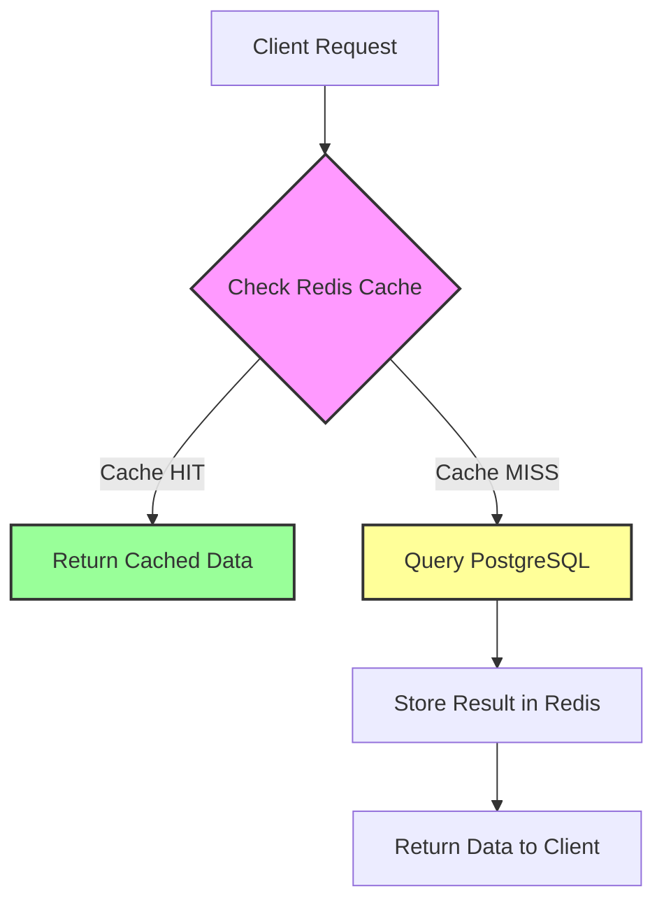

**Implementation:**

```typescript
// Generic cache-aside helper
async function cacheAside<T>(
  redis: Redis,
  key: string,
  ttlSeconds: number | null,
  fetcher: () => Promise<T>,
): Promise<T> {
  // 1. Check Redis
  const cached = await redis.get(key);
  if (cached !== null) {
    return JSON.parse(cached) as T;
  }

  // 2. Cache miss — query source
  const data = await fetcher();

  // 3. Store in Redis
  if (ttlSeconds !== null) {
    await redis.setex(key, ttlSeconds, JSON.stringify(data));
  } else {
    // No TTL — invalidated by events only (with max TTL safety net)
    await redis.setex(key, 86400, JSON.stringify(data)); // 24h fallback TTL safety net
  }

  return data;
}

// Usage: Dashboard summary
async function getDashboardSummary(orgId: string): Promise<DashboardSummary> {
  return cacheAside(
    redis,
    `org:${orgId}:dashboard`,
    null, // event-driven invalidation
    () => dashboardRepository.getSummary(orgId),
  );
}
```

### 5.4 Invalidation Strategy

Cache invalidation uses a layered approach combining event-driven invalidation with TTL fallbacks:

**Layer 1 — Event-Driven Invalidation:**

When the ingestion pipeline completes processing for an org, it publishes an event to Redis Pub/Sub. The API server subscribes to these events and invalidates affected caches immediately.

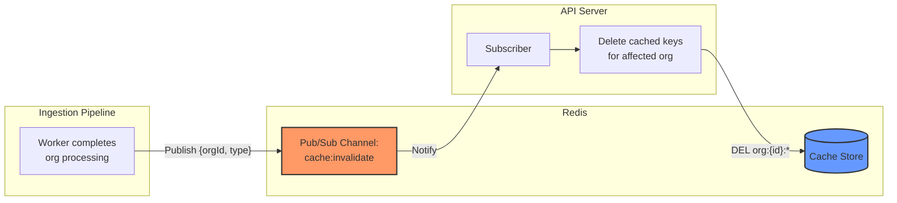

**Implementation:**

```typescript
// Publisher: Called by ingestion worker on completion
async function publishCacheInvalidation(
  redis: Redis,
  orgId: string,
  type: 'assignment' | 'biblio' | 'cpc',
): Promise<void> {
  await redis.publish(
    'cache:invalidate',
    JSON.stringify({ orgId, type, timestamp: Date.now() }),
  );
}

// Subscriber: Running in API server process
function subscribeToCacheInvalidation(
  subscriber: Redis,
  cache: Redis,
): void {
  subscriber.subscribe('cache:invalidate');

  subscriber.on('message', async (_channel: string, message: string) => {
    const { orgId, type } = JSON.parse(message);

    if (type === 'assignment') {
      // Invalidate dashboard and tree caches for this org
      // Use SCAN instead of KEYS to avoid blocking Redis
      for await (const key of cache.scanStream({ match: `org:${orgId}:*` })) {
        await cache.del(key);
      }
    } else if (type === 'cpc') {
      // Invalidate all CPC caches
      for await (const key of cache.scanStream({ match: 'cpc:*' })) {
        await cache.del(key);
      }
    }
  });
}
```

**Layer 2 — Write-Through Invalidation:**

User-initiated mutations (e.g., org settings changes, manual data corrections) invalidate caches immediately on write:

```typescript
async function updateOrgSettings(
  orgId: string,
  settings: OrgSettings,
): Promise<void> {
  // 1. Write to PostgreSQL
  await orgRepository.updateSettings(orgId, settings);

  // 2. Immediately invalidate cache (SCAN to avoid blocking Redis)
  for await (const key of redis.scanStream({ match: `org:${orgId}:*` })) {
    await redis.del(key);
  }
}
```

**Layer 3 — TTL Fallback:**

All cached items have a maximum TTL even when using event-driven invalidation, to guard against missed invalidation events:

| Invalidation Type | Max TTL Safety Net |
|---|---|
| Event-driven (dashboard, tree) | 24 hours |
| Immutable (patent biblio) | 24 hours |
| Scheduled (CPC) | 30 days |
| Short-lived (sessions) | 15 minutes |

### 5.5 Cache Warming

On API server startup or after a Redis flush, critical caches are pre-warmed:

```typescript
async function warmCriticalCaches(): Promise<void> {
  // Warm dashboard caches for active orgs
  const activeOrgs = await orgRepository.getActiveOrgs();

  for (const org of activeOrgs) {
    await cacheAside(
      redis,
      `org:${org.id}:dashboard`,
      null,
      () => dashboardRepository.getSummary(org.id),
    );
  }

  logger.info(`Warmed dashboard caches for ${activeOrgs.length} orgs`);
}
```

### 5.6 Target Metrics

| Metric | Before (Legacy) | After (Rebuilt) |
|--------|-----------------|-----------------|
| Queries per dashboard load | 10–30 SQL queries | 1–3 queries + cache hits |
| p95 dashboard response | >2,000ms | <200ms |
| p95 cached endpoint response | N/A | <100ms |
| Cache hit ratio (dashboard) | 0% | >80% |
| Database connection pressure | High (every request) | Low (cache misses only) |

### 5.7 Redis Configuration

```yaml
# Redis cache configuration
redis:
  host: ${REDIS_HOST}
  port: 6379
  db: 0          # Cache store
  # db: 1        # BullMQ job queue (separate DB)
  # db: 2        # Session store (separate DB)
  maxmemory: 512mb
  maxmemory-policy: allkeys-lru   # Evict least-recently-used when full
  
  # Connection pool
  pool:
    min: 5
    max: 20
    idleTimeoutMs: 30000
```

**Redis DB separation:**

| DB | Purpose | Eviction Policy |
|----|---------|-----------------|
| 0 | Data cache (dashboard, biblio, CPC) | `allkeys-lru` |
| 1 | BullMQ job queue | `noeviction` |
| 2 | Session store | `volatile-ttl` |

This separation ensures that cache eviction under memory pressure does not affect job queue or session data.

---

## 6. Real-Time Architecture

### 6.1 Problem Statement

The legacy system uses two incompatible real-time solutions:

- **PT-API:** Socket.IO with **no authentication** (vulnerability S-16). Any client can connect and receive events for any org.
- **PT-Admin:** Pusher.js (third-party SaaS) for admin notifications, adding an external dependency and additional cost.

The rebuilt system replaces both with a unified **Server-Sent Events (SSE)** architecture backed by Redis Pub/Sub.

### 6.2 SSE vs. WebSocket — Justification

| Criteria | SSE | WebSocket |
|----------|-----|-----------|
| **Direction** | Server → Client (push only) | Bidirectional |
| **PatenTrack need** | ✅ All real-time needs are server-push | ❌ No client→server real-time needed |
| **Auto-reconnect** | ✅ Built-in browser support | ❌ Must implement manually |
| **Proxy compatibility** | ✅ Works through HTTP proxies, CDNs | ⚠️ Requires upgrade negotiation |
| **Protocol** | HTTP/1.1 or HTTP/2 | Custom ws:// protocol |
| **Authentication** | ✅ Standard HTTP headers (JWT) | ⚠️ Must pass token in query string or first message |
| **Complexity** | Low — standard HTTP semantics | Higher — connection lifecycle management |
| **Scalability (<1000 users)** | ✅ More than sufficient | ❌ Overkill for this scale |

**Decision: SSE** — PatenTrack's real-time requirements are exclusively server→client push (ingestion progress, refresh triggers, notifications). There is no client→server real-time requirement — user actions like comments and settings changes use standard REST endpoints. SSE provides auto-reconnect, works through proxies/CDNs, uses standard HTTP authentication, and is simpler to implement and maintain.

### 6.3 Event Types

| Event | Source | Target | Payload |
|-------|--------|--------|---------|
| Ingestion progress | Worker → Redis Pub/Sub → SSE | Admin dashboard | `{jobId, step, progress}` |
| New assignments | Ingestion completion → SSE | Affected org users | `{orgId, count, refreshNeeded}` |
| Dashboard refresh | Cache invalidation → SSE | Org viewers | `{orgId, dataType}` |
| Pipeline completion | Worker → SSE | Admin | `{orgId, status, duration}` |

### 6.4 Architecture Diagram

```mermaid
flowchart LR
    subgraph "Background Workers"
        IW[Ingestion Worker]
        PW[Pipeline Worker]
    end
    
    subgraph "Redis"
        PS[Pub/Sub Channels:<br/>events:org:{id}<br/>events:admin]
    end
    
    subgraph "API Server"
        SSE_H[SSE Handler<br/>GET /api/events/stream]
        AUTH[JWT Auth Middleware]
    end
    
    subgraph "Browser Clients"
        ES1[EventSource<br/>Org User A]
        ES2[EventSource<br/>Org User B]
        ES3[EventSource<br/>Admin]
    end
    
    IW -->|"Publish progress"| PS
    PW -->|"Publish completion"| PS
    PS -->|"Subscribe"| SSE_H
    AUTH -->|"Validate JWT"| SSE_H
    SSE_H -->|"Filtered by org"| ES1
    SSE_H -->|"Filtered by org"| ES2
    SSE_H -->|"Admin events"| ES3
    
    style PS fill:#f96,stroke:#333,stroke-width:2px
    style SSE_H fill:#69f,stroke:#333,stroke-width:2px
    style AUTH fill:#9f9,stroke:#333,stroke-width:2px
```

### 6.5 SSE Endpoint Implementation

**Endpoint:** `GET /api/events/stream`

All connections require a valid JWT (fixing vulnerability S-16 from the legacy system).

```typescript
import { Router, Request, Response } from 'express';

const router = Router();

// SSE endpoint — requires authentication
router.get(
  '/api/events/stream',
  authenticateJWT, // Middleware validates JWT (see Section 3)
  async (req: Request, res: Response) => {
    const userId = req.user!.id;
    const orgId = req.user!.orgId;
    const isAdmin = req.user!.role === 'admin';

    // Set SSE headers
    res.writeHead(200, {
      'Content-Type': 'text/event-stream',
      'Cache-Control': 'no-cache',
      Connection: 'keep-alive',
      'X-Accel-Buffering': 'no', // Disable nginx buffering
    });

    // Send initial connection event
    res.write(`event: connected\ndata: ${JSON.stringify({ userId, orgId })}\n\n`);

    // Subscribe to org-specific channel
    const subscriber = redis.duplicate();
    await subscriber.subscribe(`events:org:${orgId}`);

    // Subscribe to admin channel if admin
    if (isAdmin) {
      await subscriber.subscribe('events:admin');
    }

    // Forward events to SSE stream
    subscriber.on('message', (channel: string, message: string) => {
      const event = JSON.parse(message);
      res.write(`id: ${event.id}\nevent: ${event.type}\ndata: ${JSON.stringify(event.payload)}\n\n`);
    });

    // Heartbeat every 30 seconds to keep connection alive
    const heartbeat = setInterval(() => {
      res.write(': heartbeat\n\n');
    }, 30_000);

    // Cleanup on disconnect
    req.on('close', async () => {
      clearInterval(heartbeat);
      await subscriber.unsubscribe();
      await subscriber.quit();
    });
  },
);
```

### 6.6 Event Publishing (Worker Side)

Workers publish events to Redis Pub/Sub channels:

```typescript
import { Redis } from 'ioredis';
import { randomUUID } from 'crypto';

interface SSEEvent {
  id: string;
  type: string;
  payload: Record<string, unknown>;
}

async function publishEvent(
  redis: Redis,
  channel: string,
  type: string,
  payload: Record<string, unknown>,
): Promise<void> {
  const event: SSEEvent = {
    id: randomUUID(),
    type,
    payload,
  };

  await redis.publish(channel, JSON.stringify(event));
}

// Usage in ingestion worker
async function onIngestionProgress(
  redis: Redis,
  orgId: string,
  jobId: string,
  step: string,
  progress: number,
): Promise<void> {
  // Send to org-specific channel (for org users)
  await publishEvent(redis, `events:org:${orgId}`, 'ingestion:progress', {
    jobId,
    step,
    progress,
  });

  // Send to admin channel
  await publishEvent(redis, 'events:admin', 'ingestion:progress', {
    orgId,
    jobId,
    step,
    progress,
  });
}

// Usage on pipeline completion
async function onPipelineComplete(
  redis: Redis,
  orgId: string,
  status: 'success' | 'error',
  duration: number,
): Promise<void> {
  // Notify org users that new data is available
  await publishEvent(redis, `events:org:${orgId}`, 'assignments:new', {
    orgId,
    refreshNeeded: true,
  });

  // Notify admins of pipeline completion
  await publishEvent(redis, 'events:admin', 'pipeline:complete', {
    orgId,
    status,
    duration,
  });
}
```

### 6.7 Client-Side Integration

```typescript
// Browser client — React hook for SSE
function useSSE(token: string): SSEConnection {
  const [events, setEvents] = useState<SSEEvent[]>([]);
  const [connected, setConnected] = useState(false);

  useEffect(() => {
    // EventSource with auth via custom header (using eventsource polyfill)
    const es = new EventSourcePolyfill('/api/events/stream', {
      headers: {
        Authorization: `Bearer ${token}`,
      },
    });

    es.addEventListener('connected', () => {
      setConnected(true);
    });

    // Auto-reconnect is built into EventSource
    // Last-Event-ID is sent automatically on reconnect
    es.addEventListener('ingestion:progress', (e: MessageEvent) => {
      const data = JSON.parse(e.data);
      setEvents((prev) => [...prev, { type: 'ingestion:progress', ...data }]);
    });

    es.addEventListener('assignments:new', (e: MessageEvent) => {
      const data = JSON.parse(e.data);
      // Trigger dashboard refresh
      queryClient.invalidateQueries(['dashboard', data.orgId]);
    });

    es.addEventListener('dashboard:refresh', (e: MessageEvent) => {
      const data = JSON.parse(e.data);
      queryClient.invalidateQueries(['dashboard', data.orgId]);
    });

    es.onerror = () => {
      setConnected(false);
      // EventSource auto-reconnects; no manual intervention needed
    };

    return () => {
      es.close();
    };
  }, [token]);

  return { events, connected };
}
```

### 6.8 Auto-Reconnect & Last-Event-ID

SSE has built-in reconnection support via the `Last-Event-ID` header:

1. Server sends each event with an `id` field.
2. If the connection drops, the browser automatically reconnects.
3. On reconnect, the browser sends the `Last-Event-ID` header with the last received event ID.
4. The server can use this to replay missed events (if buffered in Redis).

```typescript
// Server-side: Handle reconnection with Last-Event-ID
router.get(
  '/api/events/stream',
  authenticateJWT,
  async (req: Request, res: Response) => {
    const lastEventId = req.headers['last-event-id'] as string | undefined;

    if (lastEventId) {
      // Replay missed events from Redis stream buffer
      const missedEvents = await getMissedEvents(req.user!.orgId, lastEventId);
      for (const event of missedEvents) {
        res.write(
          `id: ${event.id}\nevent: ${event.type}\ndata: ${JSON.stringify(event.payload)}\n\n`,
        );
      }
    }

    // Continue with live event stream...
  },
);
```

### 6.9 Security Considerations

| Concern | Mitigation |
|---------|------------|
| Unauthenticated connections (S-16) | All SSE connections require valid JWT |
| Cross-org data leakage | Events filtered by org from JWT claims |
| Connection flooding | Rate limiting on SSE endpoint (max 2 connections per user) |
| Token expiration during stream | Heartbeat checks token validity; close on expiry |
| Event injection | Workers are the only publishers; no client→server channel |

### 6.10 Integration with Caching (Section 5)

The real-time architecture integrates directly with the caching strategy:

```mermaid
flowchart TD
    subgraph "Ingestion Pipeline"
        W[Worker completes<br/>org processing]
    end
    
    subgraph "Redis"
        PS[Pub/Sub]
        CACHE[(Cache Store)]
    end
    
    subgraph "API Server"
        INV[Cache Invalidator]
        SSE[SSE Handler]
    end
    
    subgraph "Browser"
        ES[EventSource Client]
        UI[Dashboard UI]
    end
    
    W -->|"1. Publish completion"| PS
    PS -->|"2a. Invalidate cache"| INV
    INV -->|"DEL org:{id}:*"| CACHE
    PS -->|"2b. Push event"| SSE
    SSE -->|"3. SSE: assignments:new"| ES
    ES -->|"4. Trigger refresh"| UI
    UI -->|"5. Fetch (cache miss → fresh data)"| CACHE
    
    style PS fill:#f96,stroke:#333,stroke-width:2px
    style CACHE fill:#69f,stroke:#333,stroke-width:2px
    style SSE fill:#9f9,stroke:#333,stroke-width:2px
```

**Flow:**
1. Ingestion worker completes processing for an org.
2. Redis Pub/Sub triggers two parallel actions:
   - **2a.** Cache invalidator deletes stale cached data for the org.
   - **2b.** SSE handler pushes a `assignments:new` event to connected clients.
3. Browser receives the SSE event.
4. Client-side code triggers a dashboard data refresh (e.g., React Query `invalidateQueries`).
5. The refresh request hits a cache miss (because cache was just invalidated), fetches fresh data from PostgreSQL, and populates the cache.

This ensures users see fresh data immediately after ingestion without polling, and the cache is always consistent with the database.

---

## Cross-References

- **Domain Model:** See `docs/design/01-domain-model.md` for complete schema design, RLS policies, migration path, and business rule preservation matrix.
- **Stage A Analysis:** See `docs/analysis/07-cross-application-summary.md` for legacy system analysis, all 65 business rules, and 30 security vulnerabilities.
- **Sections 7–10 (remaining):** Will cover API design, frontend architecture, deployment & infrastructure, and testing strategy.

---

**Document Status:** Sections 1–6 complete  
**Next:** Part B — Sections 5-9 (Caching, API Design, Frontend, Deployment, Testing)